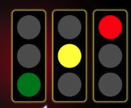

# Build a traffic light system 

Build a traffic light system with 3 lights in it 

Each has to be a circle of diameter 75 px exactly 

#### Question 1 
1. Only one can be lit at a time 
2. Diameter of each light has to be 75 px

#### Question 2
Lights need to be looping from red yellow green 

### Question 3  :  (Bonus)
On Clicking an auto button, it keeps looping 
where Red is 5 seconds , yellow is 2 seconds, and Gren is 5 seconds 
Upon clicking on a light it is stopped. 
Clicking on auto turns on the auto mode loop

`Red-> Green -> Yellow`

### Color codes
Green: #00FF00

Yellow: #FFFF00

Red: #FF0000

Gray: #DDDDDD

Black: #000000
